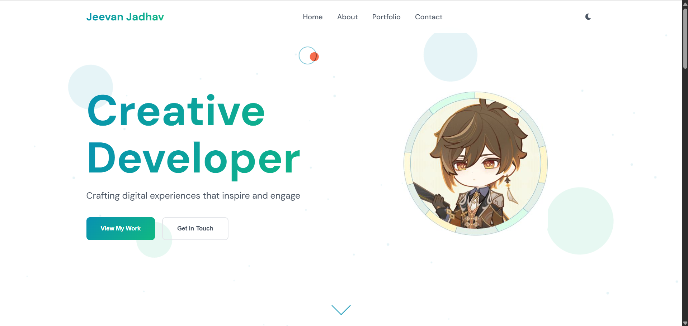
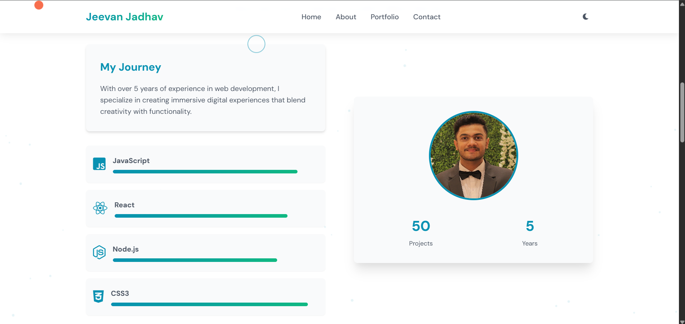

# Portfolio Template — v5

## Overview

This repository contains **Portfolio-Template-5**, a minimal, responsive single-page portfolio built with plain HTML, CSS and vanilla JavaScript. It's intended as a starter template you can customize with your own content, images and links.

---

## Demo / Screenshots

 


**Key features**

* Simple, minimal and modern one-page layout
* Sections for Hero, About, Skills/Services, Projects, and Contact
* Responsive layout that adapts to mobile and desktop
* Small, dependency-free codebase (no frameworks)

---

## Quick start

To preview the template locally:

1. Clone or download the repository:

```bash
git clone https://github.com/NOVA0206/Portfolio-Template-5.git
cd Portfolio-Template-5
```

2. Open `Portfolio5.html` in your web browser (double-click or use `Live Server` extension in VS Code).

3. Edit content:

   * Replace `Jeevan.jpg` (or `Zhongli.jpg`) in the HTML with your avatar/profile image.
   * Edit the text sections in `Portfolio5.html` (About, Projects, Contact).
   * Tune typography/colors in `style5.css`.
   * Modify interactions in `script5.js` if required.

---

## Customization guide

* **Swap images**: replace images in the repo's root (or update the paths in the HTML).
* **Projects**: edit the Projects section in `Portfolio5.html` to add or remove cards; update images and descriptions.
* **Fonts**: add Google Fonts links to the `<head>` of the HTML and update CSS font-family.
* **Colors / theme**: change variables or direct color values in `style5.css`.
* **Make it multi-page**: duplicate `Portfolio5.html` or convert sections into separate pages and update navigation links.

---

## License

This project is published under the **MIT License**. See the `LICENSE` file for details. citeturn0view0

---

## Author / Contact

Original repository by `NOVA0206`.

*Gmail: **jeevanj020604@gmail.com**

*Name: **Jeevan Jadhav** 
